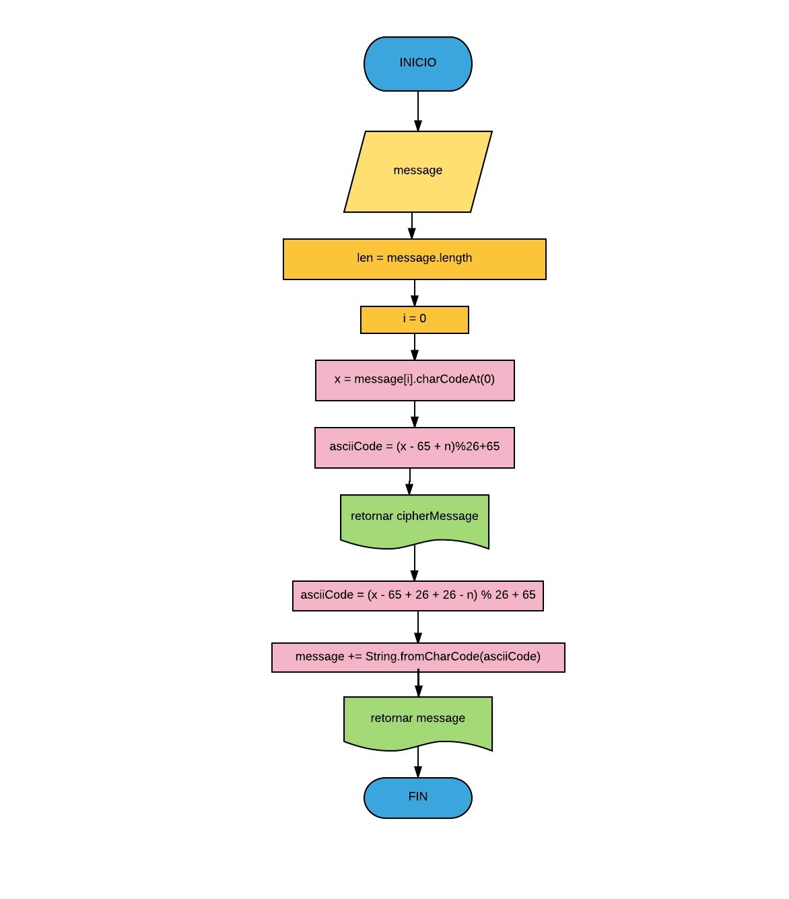

**Pseudocodigo**
================
**Inicio**
---------  
>### Ingresar **message** ###  

>### *len = message.length* ### 
>### *i= 0* ;  *cipherMessage = ' '* ; *n= 33* ###  

>### **x = message[ *i* ].charCodeAt(0)** ###  
>### **asciCode = (x - 65 + n)% 26+ 65** ### 

>### retornar *cipherMessage* ###
            
>### **asciiCode = (x - 65 + 26 + 26 - n)% 26 +65** ###  
>### *mesage += String.fromCharCode(asciiCode)* ###

>### retornar *message* ###

**Fin**
------