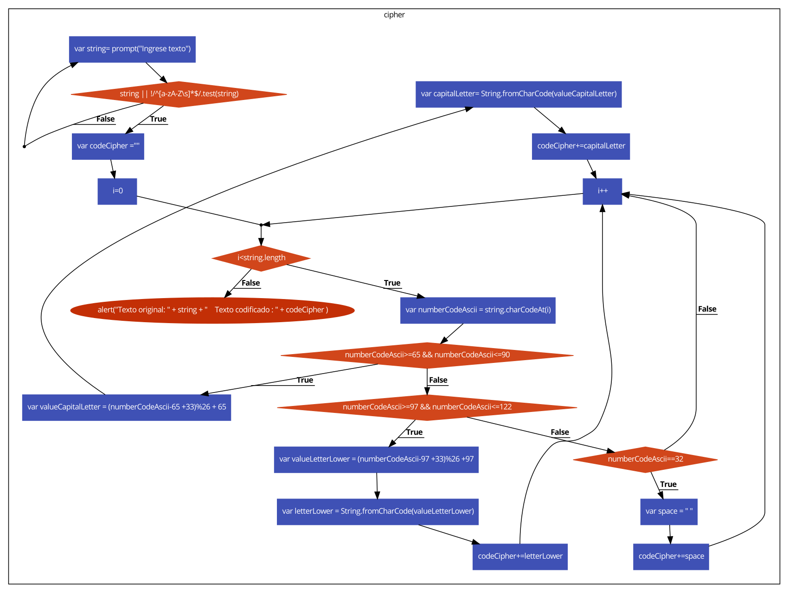
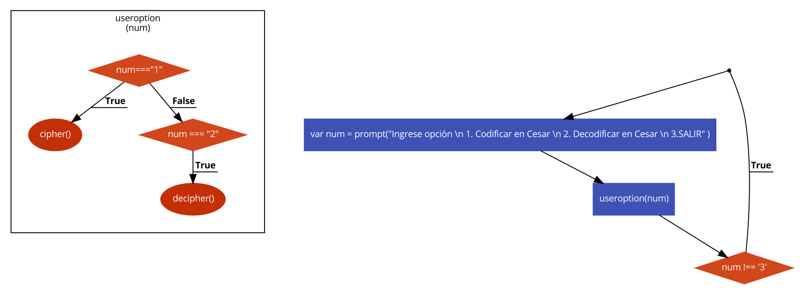

## Cifrado y Descifrado Cesar

La siguiente web ha sido diseñada para cifrar y descifrar palabras según el algoritmo del cifrado de Cesar.
Más información sobre el cifrado de Cesar en el siguiente link: [Caesar_cipher](https://en.wikipedia.org/wiki/Caesar_cipher)

Diagrama de flujo Cifrado :

Diagrama de flujo Descifrado :


Diagrama de flujo Función menú principal



La web esta conformada por un página principal llamada Index.html que contiene una función llamada **useroption(num)** que recibe un parametro , que es el número de la opción requerida . Esta función aloja las dos funciones de cifrado y decifrado, y las llama mediante un **prompt** , dependiendo de la opción que elija el usuario

* Opción 1 : Cifrado César
* Opción 2 : Descifrado César
* Opción 3 : Salir

 Existe una validación si el usuario ingresa otra opción no mencionada, mostrará regresara al **prompt** hasta que se ingrese una opción válida.

 Este menú se encuentra fuera de la función useroption(num) y es invocado mediante una estructura Do - While . Dentro de esta estructura hay un **prompt** que describe las opciones del menú y valida el ingreso de datos.

Ambas opciones (cifrado y decifrado ) obtienen la entrada de datos mediante un **prompt** y muestra el texto convertido en la página web.


### Especificaciones de la función Cipher

Para la función **cipher** se implemento lo siguiente :
*  Validar que no se ingrese números ni que el campo este vacio.

```javascript
do{
    var string= prompt("Ingrese texto")
  }
while (!string || !/^[a-zA-Z\s]*$/.test(string) );

```


*  Crear una variable string con valor obtenido mediante un prompt ("Ingrese texto a codificar").
*  Crear una variable codeCipher con valor = "", donde se va a concatenar los valores ya codificados y este valor es que el se va a mostrar como resultado final del cifrado.

*  Implementar un for que recorra la cadena , letra por letra para ir cambiandola según la fórmula del cifrado de Cesar.
*  Dentro del **for** creamos una variable  numberCodeAscii
que obtiene el código ASCII de la letra recorrida .
```javascript
var numberCodeAscii = string.charCodeAt(i);
```
* Condicionar el valor del código ASCII según los rangos establecidos.
    *  Mayor o igual que 65 y menor o igual que 90 , para letras mayúsculas.
    * Mayor o igual que 97 y menor o igual que 122, para letras minúsculas.
*  Si es mayúscula :
    * Asignar a una variable **valueCapitalLetter** el valor obtenido según la fórmula . Este valor es el nuevo código ASCII de la letra.
```javascript
var valueCapitalLetter = (numberCodeAscii-65 +33)%26 + 65;
```
* Si es minúscula :

    * Asignar a una variable **valueLetterLower** el valor obtenido según la fórmula . Este valor es el nuevo código ASCII de la letra.

```javascript
    var valueLetterLower = (numberCodeAscii-97 +33)%26 +97;
```
* Convertir el código ASCII obtenido a una letra del alfabeto.
*  Concatenar cada nueva letra obtenida a la variable codeCipher.
* Si hay un espacio, solo se reasigna su valor y se concatena.

*  Mostrar la palabra convertida en  un alert.

### Especificaciones de la función decipher

Para la función **decipher** se implemento lo siguiente :

*  Crear una variable string con valor obtenido mediante un prompt ("Ingrese texto a codificar").
*  Crear una variable codeCipher con valor = "", donde se va a concatenar los valores ya codificados y este valor es que el se va a mostrar como resultado final del cifrado.
*  Validar que no se ingrese números ni que el campo este vacio.
*  Implementar un for que recorra la cadena , letra por letra para ir cambiandola según la fórmula del cifrado de Cesar.
*  Dentro del **for** creamos una variable  numberCodeAscii
que obtiene el código ASCII de la letra recorrida .
```javascript
var numberCodeAscii = string.charCodeAt(i);
```
* Condicionar el valor del código ASCII según los rangos establecidos.
    *  Mayor o igual que 65 y menor o igual que 90 , para letras mayúsculas.
    * Mayor o igual que 97 y menor o igual que 122, para letras minúsculas.
*  Si es mayúscula :
    * Asignar a una variable **valueCapitalLetter** el valor obtenido según la fórmula . Este valor es el nuevo código ASCII de la letra.
```javascript
var valueCapitalLetter = (numberCodeAscii+65-33)%26+65 ;
```
* Si es minúscula :

    * Asignar a una variable **valueLetterLower** el valor obtenido según la fórmula . Este valor es el nuevo código ASCII de la letra.
```javascript
var valueLetterLower =  (numberCodeAscii+97-45)%26-97
```
* Convertir el código ASCII obtenido a una letra del alfabeto

*  Concatenar cada nueva letra obtenida a la variable codeCipher.

* Si hay un espacio, solo se reasigna su valor y se concatena.
*  Mostrar la palabra convertida en un alert.

### Especificaciones de la función useroption(num)
La función useroption(num) almacena dentro de ella las funciones de cifrado y decifrado.
* Crear un **if** , con la primera condición
num ==="1"  que llamará a la función cifrado.
*  Dentro de ella se alojara el código de cifrado cesar mencionado anteriormente.
* Crear un  **else if** con la opción num ==="2" que llamará a la función decifrado.
* Dentro de ella se alojara el código de decifrado cesar mencionado anteriormente.

* Salir de esta función e invocarla mediante una estructura Do - While, que almacena un prompt con las opciones del menú y una validación que no ingrese otro valor diferente 1,2 o 3.
