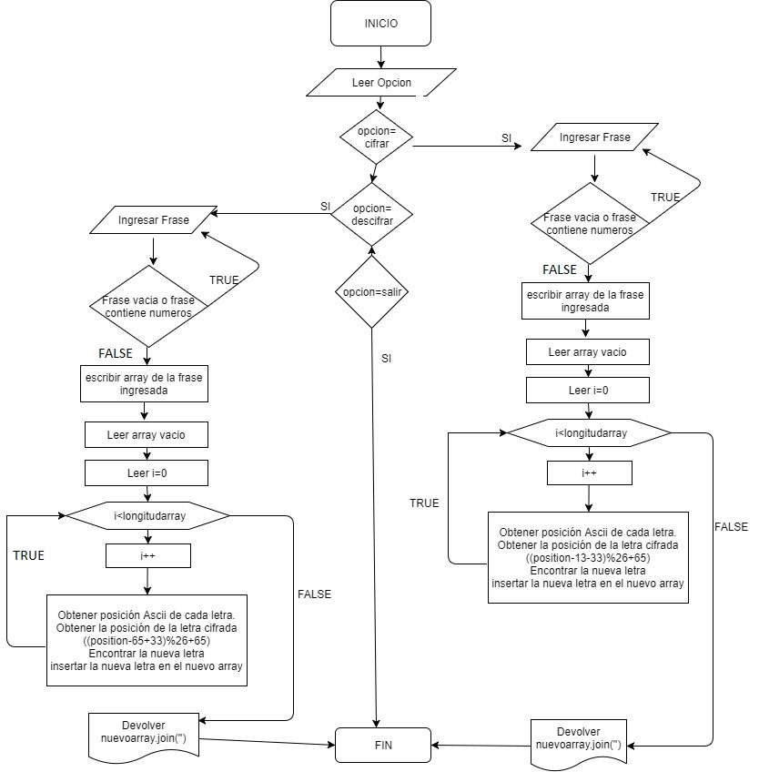

# Pseudocodigo encrypted-cesar
Ingresar al menu de opciones
* si el valor de la opcion es 1, ingresa a la funcion cipher
* si el valor de la opcion es 2 ingresa a la funcion descipher
* si el valor de la opcion es 3 sale del sistema
* si el valor de la opcion es otra indica que no existe la opcion
* function cipher()
    * leer phrase
    * si (phrase es vacio o contiene numeros) entonces
        * leer frase
    * si no
      * escribir array de phrase
      * escribir array vacio
      * para (var i = 0; i < array.length; i++) hacer
           * positionAscii = array[i].charCodeAt();
           * positionEncryptedLetter = ((positionAscii - 65 + 33) % 26 + 65);
           * encryptedLetter = String.fromCharCode(positionEncryptedLetter);
          newArray.push(encryptedLetter);
      * Fin para
       * escribir texto encriptado
* Fin Funcion

* function descipher()

  * leer phrase
  * si (phrase es vacio o contiene numeros) entonces
      * leer frase
  * si no
    * escribir array de phrase
    * escribir array de phrase
    * escribir array vacio
    * para (var i = 0; i < array.length; i++) hacer
          * var positionAscii = array[i].charCodeAt();
          * var positionEncryptedLetter = (positionAscii - 13 - 33 % 26 + 65);
          * var decrypt =String.fromCharCode(positionEncryptedLetter);
          * newArray.push(decrypt);
*  Fin para
  * escribir texto desencriptado

* Fin funcion
* function menu(option)
  * si opcion=1 entonces
      * ejecutar cipher
  * si no si opcion=2 entonces
      * ejecutar descipher
  * si no si opcion=3 entonces
      * escribir hasta pronto
  * si no entonces
      * escribir no existe esa opcion
* Fin funcion
* Repetir
     * strMenu = '1.Escriba 1 para cifrar una frase \n 2.Escriba 2 para descifrar una frase \n 3. Escriba 3 para salir';
     * option = parseInt(prompt(strMenu));
     * menu(option);
* hasta que (option != 3 && typeof (option) === "number");

