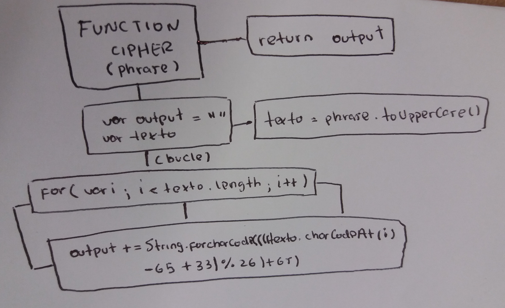
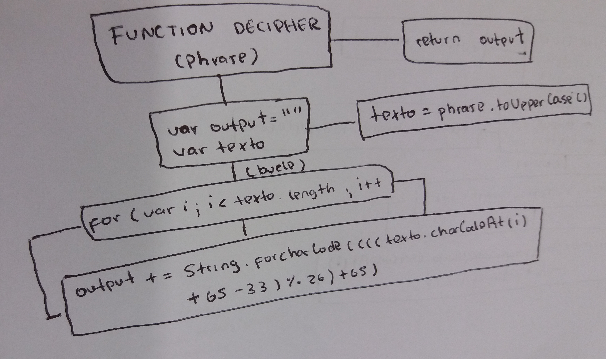
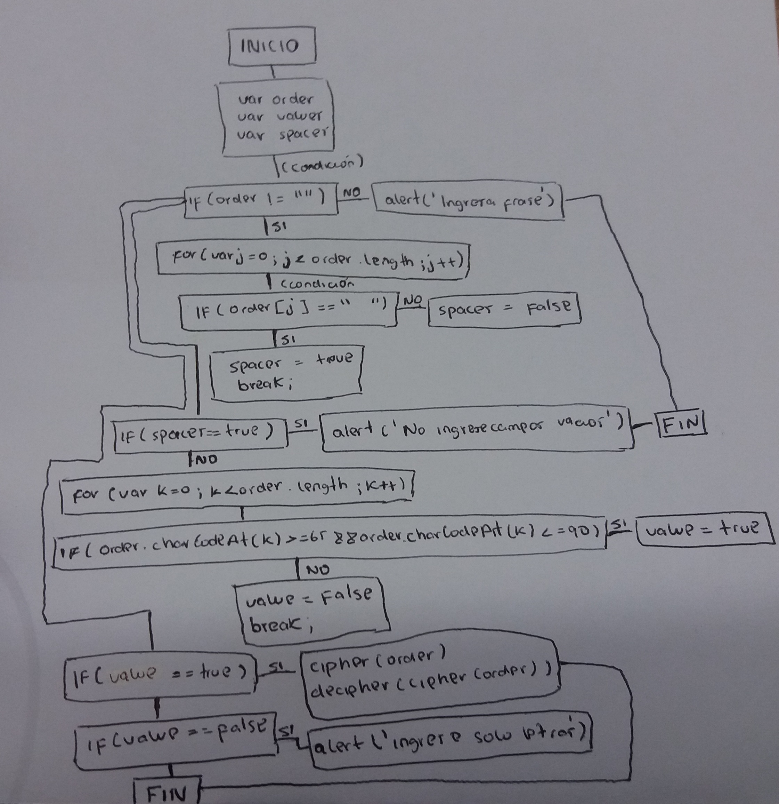

# PRODUCTO FINAL - CIFRADO CÉSAR

### PSEUDOCODIGO:

Creamos función Cipher:
~~~
Funcion Cipher(phrase){  
    
    Definir output,texto,i  

    output = ''(vacio)  
    texto = phrase(convertido en mayusculas)

    Para( i = 0 , i < longitud de la variable texto , i = i + 1){

    output = output + String.fromCharCode(Devuelve una cadena desde un numero ASCII)((((texto.charCodeAt[ i ](Devuelve numero ASCII de la variable texto1 en su indice i )-65)+33)%26)+65)
    }

    retorne variable output
}
~~~
Ahora creamos una funcion Decipher a la cual no le cambiamos las variables porque son distintas funciones:
~~~
Funcion Decipher(phrase){  
    
    Definimos como variable a output,texto,i

    output = ''(vacio)  
    texto = phrase(convertido en mayusculas)

    Para( i = 0 , i<longitud de la variable texto , j = j + 1){

    output = output + String.fromCharCode(Devuelve una cadena desde un numero ASCII)((((texto.charCodeAt[ i ](Devuelve numero ASCII de la variable texto en su indice i )+65)-33)%26)+65)
    }

    retorne variable output
}
~~~
Ahora que ya tenemos las funciones creadas pasaremos a preguntar al usuario, validar y llamar a las funciones:  
~~~
Definimos como variable a order,k,value,spaces

order = prompt('Ingresa una frase')(Pide al usuario)

Si(order es distinto de ""(vacio))Entonces{

    Para (j = 0 , j < longitud de la variable order,j = j + 1){
        Si(order en la posicion [ j ] es igual a " " (campo en blanco) )Entonces{

            spaces = true
            break; (sale del bucle)

        }Sino{

            spaces = false
        }    
    }

    Si (spaces = true) Entonces{

        Alerta ('No ingrese campos en blanco')  

    }Sino{     

        Para (k = 0 , k < longitud de la variable order,k = k + 1){
            Si(order convertido a ASCII mayor 64 y menor a 91 )Entonces{

                value = true
        
            }Sino{

                value = false
                Alerta ('Ingrese solo letras')
            }    
        }

        Si (value = true) Entonces{

        Escribir en documento ('Cifrado  ->' + (LLamamos a la funcion Cipher) Cipher(order))
        Escribir en documento ('
 Decifrado  ->' + (LLamamos a la funcion Decipher) Decipher(order))

        }
    }

}Sino{

    Alerta('Ingrese una frase')
}    
~~~

### DIAGRAMA DE FLUJO

Funcion Cipher:

Funcion Decipher:

Validando y llamando a las funciones:

