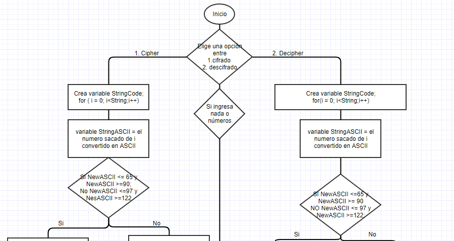
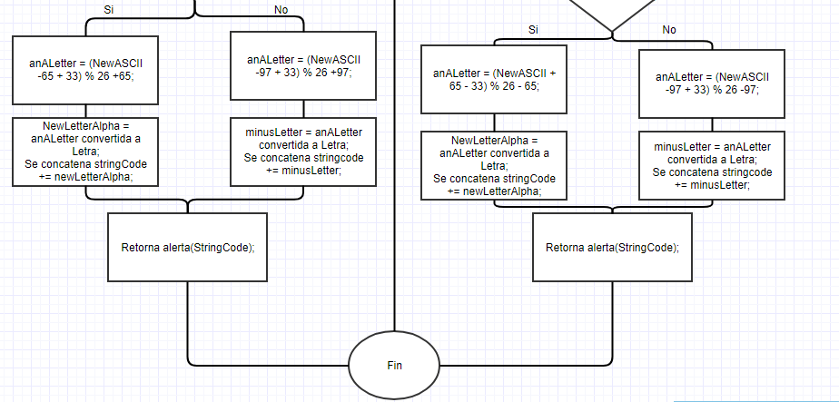

# Caesar cipher
___
### Inicio del programa
* Al ingresar elegir entre las dos opciones
     1. Cifrado 
     2. Decifrado

* Si **1** -> Llama función Cipher
    1. Crea variable StringCode.
    2. Inicializa i = 0; si **i** es menor que **String**; aumentar + 1{
    3. Variable **stringASCII** es igual a **String** donde transformara el numero sacado en i a codigo ASCII.
    4. **SI** NewASCII es >= que 65 y NewASCII es <= 90 {
         * anALetter = (NewASCII - 65 + 33) residuo de 26 + 65;
         * newLetterAlpha = la respuesta de anALetter convertida a letra;
         * se concatena Stringcode += newLetterAlpha;
    }
    5. **NO** NewASCII es >= que 97 y NewASCII es <=122 {
        * anALetter =(NewASCII - 97 + 33)residuo de 26 + 97;
        * minusLetter = la respuesta de anALetter convertida en letra;
        * se concatena Stringcode +=minusLetter;
    }
    }
    retornara alerta(StringCode);
}
* Si **2** -> LLama función Decipher
    1. Crea variable StringCode.
    2. Inicializa i = 0; si **i** es menor **String**; aumentar + 1.{
        * varialbe **stringASCII** es igual a **String** donde transformara el numero sacado en i a ASCII.
        * **si** NewASCII es >= 65 && NewASCII <=90{
            * variable anALetter =(NewsASCII + 65 - 33) residuo de 26 -65;
            * variable newLetterAlpha = la respuesta de anALetter convertida a letra;
            * se concatena stringcode += newLetterAlpha;
        }
    3. **NO** NewASCII es >= que 97 y NewASCII es <= 122{
        * variable minusLetter = (NewASCII - 97+ 33 ) residuo de 26 - 97;
        * variable newMinusLetter = la respuesta de minusLetter convertida a letra;
        * se concatena stringCode += newMnusLetter;
    }
}
retornar alerta(stringCode);
}

~~~
Formula (n + 33) % 26 ; 
~~~

# Ceasar-Cipher-DCR
