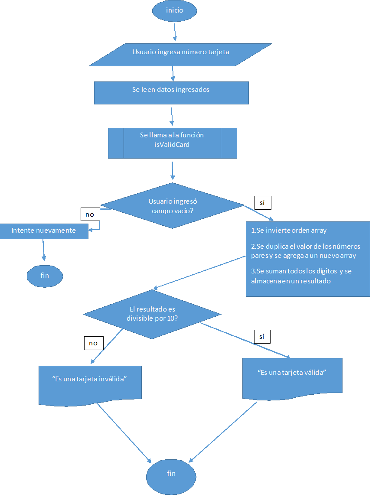

# Cifrado de César

## Primer ejercicio Producto Final

Consideraciones:
1.Tu programa debe ser capaz de cifrar y descifrar tanto letras mayúsculas como minúsculas. La fórmula para descifrar es: (x - n) % 26

2.El código debe estar compuesto por 2 funciones con los siguientes nombres: cipher y decipher

3.El usuario no debe poder ingresar un campo vacío o que contenga números.

### Diagrama de flujo

### Pseudocódigo

        INICIO

        Función cipher(message)
            newString <- message.toUpperCase()
        Para (j = 0; j < newString.length; j++)
        Si newString[j] >= 65 y newString <= 90 Entonces
        positionAlphabetAscii <- newString[j].charCodeAt()
        newPositionEncript <- aplicamos formula de cifrado de cesar a positionAlphabetAscii
        encriptWord += newPositionEncript
        Si no Entonces
        encriptWord <- alert('Solo se aceptan letras. Intentalo  nuevamente!')
        Fin Si
        Fin Para

        Retornar encriptWord

        Fin Función
        Función decipher(message)
        newString <- message.toUpperCase()
        Para (j = 0; j < newString.length; j++)
        Si newString[j] >= 65 y newString <= 90 Entonces
        positionAlphabetAscii <- newString[j].charCodeAt()
        newPositionEncript <- aplicamos formula de decifrado de cesar a positionAlphabetAscii
        encriptWord += newPositionEncript
        Si no Entonces
        encriptWord <- alert('Solo se aceptan letras. Intentalo  nuevamente!')
        Fin Si
        Fin Para

        Retornar encriptWord

        Fin Función
        Hacer message <- prompt('Ingrese una palabra')
        Si message === null
        alert('Regresa pronto :) ')
        Si no si message.length === 0 Entonces
        alert('Tu mensaje esta vacio intentalo nuevamente')
        Si  no menuOpc = '1.-Cifrar\n' + '2.-Decifrar' Entonces
        opc <- prompt(menuOpc, 'Elige una opción:')
        Si opc === '1' Entonces
        Llamar Función cipher
        Si no si opc === '2' Entonces
        Llamar Función decipher
        Si no Entonces
        alert('Intentalo nuevamente')

        Fin Si
        Repetir Mientras (!message)
        Fin