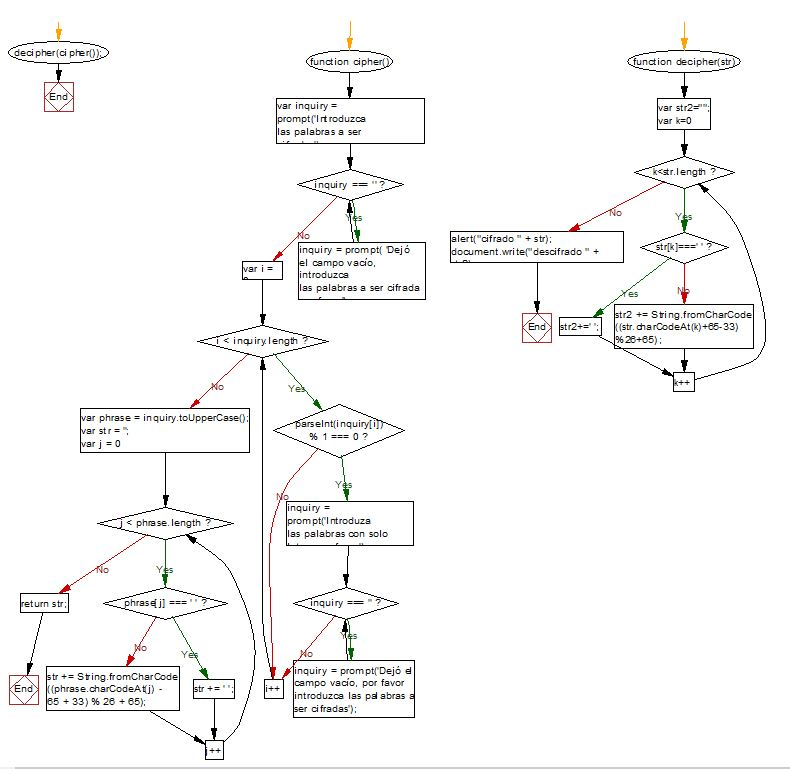

# Ceasar Cipher method
#  **coded in JavaScript**

### This document is intend to show the regular user how the ceasar cipher method works on JavaScript

### We ask the user to enter a phrase (It could be a single word or a sentence with spaces). The user isn't going to be able to introduce a number as a character or to leave the answer window blank.

### After this the program is going to assign each character its ASCII number, then is going to assign the character its number in the decimal count (1-26). Finally is going to return the new letter in a new string.

### This new string contains the phrase (or word) changed by the ceasar cipher method used.

### Now, we are going to show you the **_pseudocode_** and the **_flowchart_** associated to this code.

>PSEUDOCODE

>#### Proceso ceasarCipher
>####	Hacer con un prompt "Introduzca frase a cifrar";
>####	Mientras frase = '' (campo vacio)
>####    Seguir haciendo prompt "Introduzca frase a cifrar";
>####	Leer frase;
>####	inquiry <- HOLA COMO ESTAS;
>####    Si inquiry contiene numeros
>####    Entonces seguir con prompt "Introduzca frase a cifrar sin numeros";
>####    phrase=inquiry.toUpperCase (Guardamos el inquiry convertido a mayusculas en una nueva variable)
>####	emptyString <- '' (declaramos un string vacio);
>####	recorriendo phrase;
>####	Si posicion en phrase <- ' ' (espacio en blanco entre palabras de la frase)
>####    Entonces emptyString+=' ' (se escribe el espacio en blanco en el string vacio;		
>####	SiNo emptyString = formula de ceasarCipher (se le aplica la formula del codigo cesar a los caracteres);	
>####	Retornamos la frase ya cifrada contenida en emptyString
>####    Devolvemos mediante un alert "Tu frase cifrada es" + emptyString

#### **Inmediatamente creamos la funcion decipher**
>#### Proceso ceasarDecipher
>####    Declaramos un string vacio;
>####    str2=" ";
>####    recorremos el str del cipher
>####    Si str[k]=" " (Si encuentra espacios en blanco debe pasarlos igual al str2)
>####    SiNo str2 <- aplicamos la formula de descifrado a cada elemento del strinf str
>####    Devolvemos escrito en la pagina web la palabra descifrada
>#### FinProceso

>FLOWCHART

