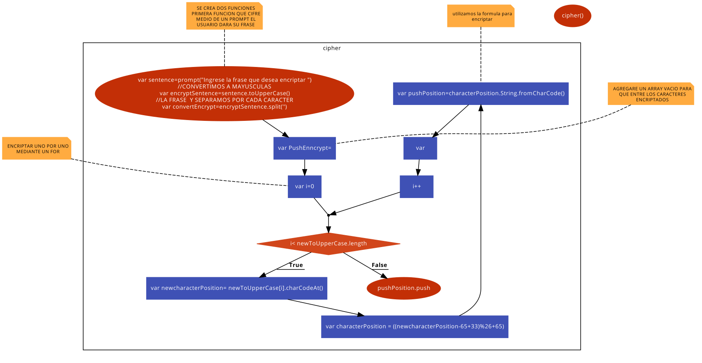

# CIFRADO Cesar
#### SE CREA DOS FUNCIONES

#SE CREA DOS FUNCIONES
1. Primera **function cipher(){** que se hace para cifrar y se hace una **var** lo nombramos **sentence** es igual a un **prompt("Ingrese la frase que desea cifrar ");**

 Se crea otra **var** nombrado **convertEncrypt** es igual a **sentence.split('');**
la **var**  se nombra **pushEnncrypt** es igual aun array vacio **[];**
media un **for(var i** es igual **0;** **i**menor a **convertEncrypt.length;** i++){
la **var** nombrado **newcharacterPosition** es igual **convertEncrypt[i].charCodeAt();** utilizamos la formula para encriptar **var** nombrado **characterPosition** es igual **((newcharacterPosition** menos **65** más **33)** modulo **26** más **65);**
devuelve una cadena creada mediante el uso de una secuencia de valores DE LA FORMULA QUE HICIMOS ARRIBA
**var pushPosition=characterPosition.String.fromCharCode(characterPosition);**
  AHORA AGREGAMOS Y JUNTAMOS LO CIFRADO EN EL ARRAY VACIO
         **pushEnncrypt.push(pushPosition) && pushEnncrypt.join(pushPosition)**
}
 y **return pushEnncrypt()**
}
 llamamos la funcion **cipher()**

#SEGUNDA FUNCION QUE DECIFRA

2. la **function** llamada  **decipher(){** ENTRAR UN PROMPT PARA QUE EL USUARIO ME DEVUELVA LO QUE SE LE indica
con **var** nombrado **phrase** es igual  **prompt("Ingresa lo que deseas decifrar");**
LOS CARACTERES INGRESADOS SE SEPARAN  mediante un **var phraseSplit** es igual a **phrase.split();**
COLOCAMOS UN ARRAY VACIO PARA LUEGO EL DECIFRADO ENTRE **var pushDecipher** es igual a [];
MEDIANTE UN FOR LO QUE INGRESO EL USUARIO COMENZARA A CONTAR UNO POR UNO
 **for (var i=0; i<phraseSplit.length;i++){**
EL INDICE ES tODO LO QUE ENTRA EL USUARIO
**var newDecipher=phraseSplit[i];**
SE PONE LA FORMULA PARA DECIFRARLO
**var starDecipher=(newDecipher - 33) % 26;**
EL RESULTADO SE AGREGA Y JUNTA LOS CARACTERES AL ARRAY VACIO
**pushDecipher.push(starDecipher) && pushDecipher.join(starDecipher);
 }**
y **return pushDecipher()** RETONAR AL ARRAR VACIO
**}**
**decipher()** llamamos a la function

diagrama de flujo 
